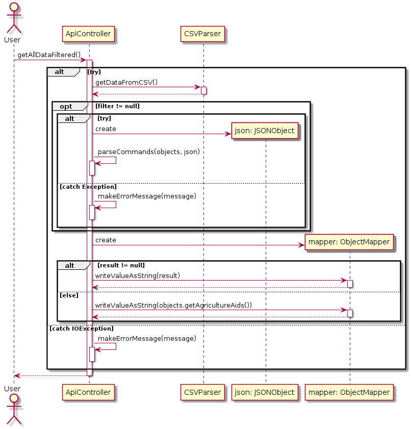

# ProgettoOOP
L'applicazione presente nella repository è una REST API che permette di ottenere dei dati a partire da un dataset contenuto in un file CSV, permettendo di filtrarli in maniera opportuna e di ottenere delle statistiche su alcuni dei campi.

## Formato dei dati restituiti
In seguito ad una richiesta al servizio viene restituito come risultato un JSON rappresentante un array di oggetti rappresentanti i dati appartenenti al dataset. Il formato dell'oggetto rappresentante il singolo elemento, nello specifico è il seguente:
```
    {
        "freq": "A",
        "geo": "BG",
        "unit": "MEUR_KP_PRE",
        "objectiv": "TOTAL",
        "aids": {
            "2000": 0,
            "2001": 0,
            "2002": 0,
            "2003": 0,
            "2004": 0,
            "2005": 0,
            "2006": 0,
            "2007": 207.151,
            "2008": 218.413,
            "2009": 167.885,
            "2010": 20.427,
            "2011": 20.644,
            "2012": 48.445,
            "2013": 78.83,
            "2014": 117.345,
            "2015": 91.009,
            "2016": 64.292,
            "2017": 81.049
        }
    }
```
In particolare:
 - **freq** rappresenta la frequenza del campionamento del dato
 - **geo** rappresenta l'entità geopolitica di interesse
 - **unit** rappresenta l'unità di misura utilizzata per il dato
 - **objective** mostra l'obiettivo che il dato ha ricoperto
 - **aids** è un oggetto rappresentante tutti i sussidi ricevuti nell'ambito dell'agricoltura diviso per anno. Per filtrare i campi è possibile accedere direttamente all'anno per andare ad applicare i filtri desiderati.

Le statistiche possono invece essere effettuate soltanto sull'anno specifico oppure su un dato specifico, specificando l'area geografica e l'unità di misura. Degli esempi di oggetti JSON restituiti per entrambi i casi possono essere i seguenti:
```
{
	    "avg": 179.01416,
	    "min": {
	        "geo": [
	            "MT"
	        ],
	        "value": 0
	    },
	    "field": "2016",
	    "max": {
	        "geo": [
	            "DE"
	        ],
	        "value": 1038.131
	    },
	    "devstd": 235.65442,
	    "sum": 4654.368
    }
```
```
    {
	    "geo": "IT",
	    "unit": "MEUR_KP_PRE",
	    "avg": 810.1978,
	    "min": {
	        "year": [
	            "2002"
	        ],
	        "value": 392.791
	    },
	    "max": {
	        "year": [
	            "2015"
	        ],
	        "value": 1407.813
	    },
	    "devstd": 291.66656,
	    "sum": 14583.561
    }
```

Si noti come, per i due casi, si è anche scelto di memorizzare in corrispondenza di quali dati sono presenti i valori minimi e massimi.

## Rotte dell'applicazione
Gli endpoint specificati nell'applicazione per effettuare le varie richieste sono le seguenti:

> **GET** /

Rotta in cui è possibile accedere ad un'interfaccia grafica che permette di eseguire le operazioni di ricerca e di effettuamento delle statistiche senza la necessità di utilizzare linguaggi di programmazione e/o tool esterni quali Postman per effettuare le richieste.

> **POST** /metadata

Rotta in cui è possibile accedere ai metadati relativi all'oggetto restituito dal servizio.

> **POST** /data

Effettuando una richiesta POST su questa rotta è possibile ottenere i dati appartenente al dataset. In particolare si distinguono due casi:

 - **Corpo della richiesta non presente:** in questo caso verranno restituiti tutti i dati appartenenti al dataset, senza applicare alcun filtro.
 - **Corpo della richiesta contenente il filtro:** in questo caso il dato verrà filtrato secondo secondo i filtri specificati.

> **POST** /stats/year/{ year }

Effettuando una richiesta POST su questa rotta, indicando esplicitamente l'anno, è possibile ottenere delle statistiche riguardanti i sussidi ricevuti in quell'anno, potendo eventualmente specificare dei filtri sul dataset per prendere in considerazione solo alcuni dei dati. Analogamente al caso precedente si ha che se il corpo della richiesta non è presente allora la statistica verrà effettuata su tutti i dati, senza applicare il filtro, altrimenti la statistica verrà effettuata solo sulla parte del dataset filtrata dal filtro presente nel corpo della richiesta.

> **GET** /stats/geo/{ geo }/unit/{ unit }

Effettuando una richiesta GET su questa rotta, specificando l'area geografica e l'unità di misura, è possibile ottenere delle specifiche sul singolo dato, andando a fare tutte le operazioni statistiche sui vari sussidi ricevuti dall'anno 2000 all'anno 2017. Vista la natura della statistica in questo caso non è previsto l'utilizzo di filtri.

## Filtri
Il filtro presente nel corpo della richiesta POST per filtrare i dati è una stringa in formato JSON, contenente degli oggetti dotati della seguente struttura:

```
    {
	    "<campo>": {
		    "<operatore>": <dato>
		}
    }
``` 

Il campo su cui è possibile applicare il filtro è uno tra i campi già presentati sopra (geo, freq, unit, objective, 2000, 2001, ... , 2017), mentre gli operatori che è possibile utilizzare sono i seguenti:

 - **$eq:** indica se il valore associato al campo è uguale a quello indicato nel filtro
 - **$not:** indica se il valore associato al campo è diverso da quello indicato nel filtro
 - **$lt:** indica se il valore associato al campo è più grande rispetto a quello indicato nel filtro
 - **$gt:** indica se il valore associato al campo è più piccolo rispetto a quello indicato nel filtro
 - **$bt:** specificati due valori numerici, indica se il valore associato al campo è compreso tra questi due valori
 - **$in:** specificato un insieme di valori, indica se il valore associato al campo è uno di questi valori
 - **$nin:** specificato un insieme di valori, indica se il valore associato al campo non è nessuno di questi valori.

I valori presenti come dato su cui eseguire il filtro possono essere delle stringhe, dei valori numerici oppure (nel caso degli ultimi tre operatori sopra specificati) un array contenente più valori dello stesso tipo.

E' inoltre possibile unire più filtri insieme, mediante l'uso di una logica AND oppure OR. Per far ciò, la struttura della richiesta è la seguente:

```
    {
	    "<operatore logico>": [{<filtro1>},{<filtro2>},...]
	}
```

Dove l'operatore logico può assumere i valori **\$and** (nel caso di una logica in AND) e **\$or** (nel caso di una logica in OR). E' possibile eventualmente innestare tra di loro più operatori logici, inserendoli al posto di eventuali filtri. Alcuni esempi di filtri possono essere i seguenti:

```
{
	"geo": {
		"$eq": "IT"
	}
}
```

```
    {
	    "$and": [
	        {
	            "geo": {
	                "$nin": ["IT", "EU28", "LU"]
	            }
	        },
	        {
	        	"unit": {
	        		"$not": "PC_GDP"
	        	}
	        }
	    ]
    }
```

```
{
    "$and": [
        {
            "2010": {
                "$lt": 1000
            }
        },
        {
            "unit": {
                "$eq": "MEUR_KP_PRE"
            }
        },
        {
        	"$or": [
        		{
        			"geo": {
        				"$eq": "IT"
        			}
        		},
        		{
        			"geo": {
        				"$eq": "UK"
        			}
        		}
        	]
        }
    ]
}
```

## Frontend

Al fine di semplificare l'operazione di filtro e l'esecuzione delle statistiche, è stato realizzato insieme all'applicazione un'interfaccia grafica, accessibile dalla homepage del servizio, che comunicando con l'API descritta sopra mette a disposizione tutte le operazioni che offre senza l'utilizzo di linguaggi di programmazione e/o tool appositi. Il frontend è stato realizzato con il framework Vue.js, che ci ha permesso una realizzazione veloce ed efficiente del sito.


# UML

## Class Diagram


## Use Case Diagram

## Sequence Diagram

Funzione che va a richiedere i dati eseguendo un filtro su questi:


